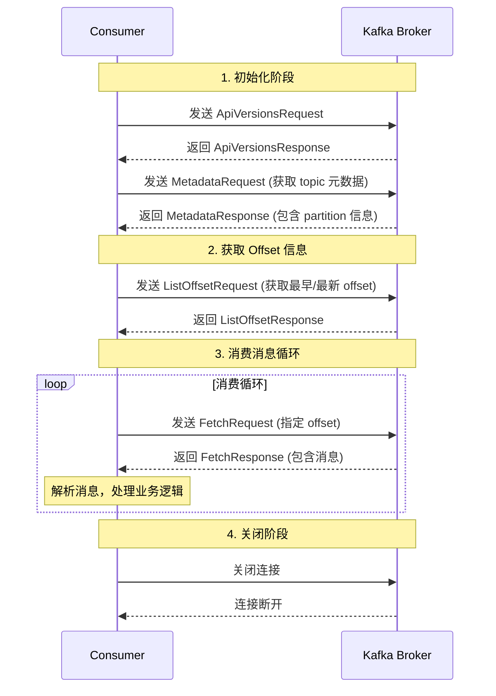
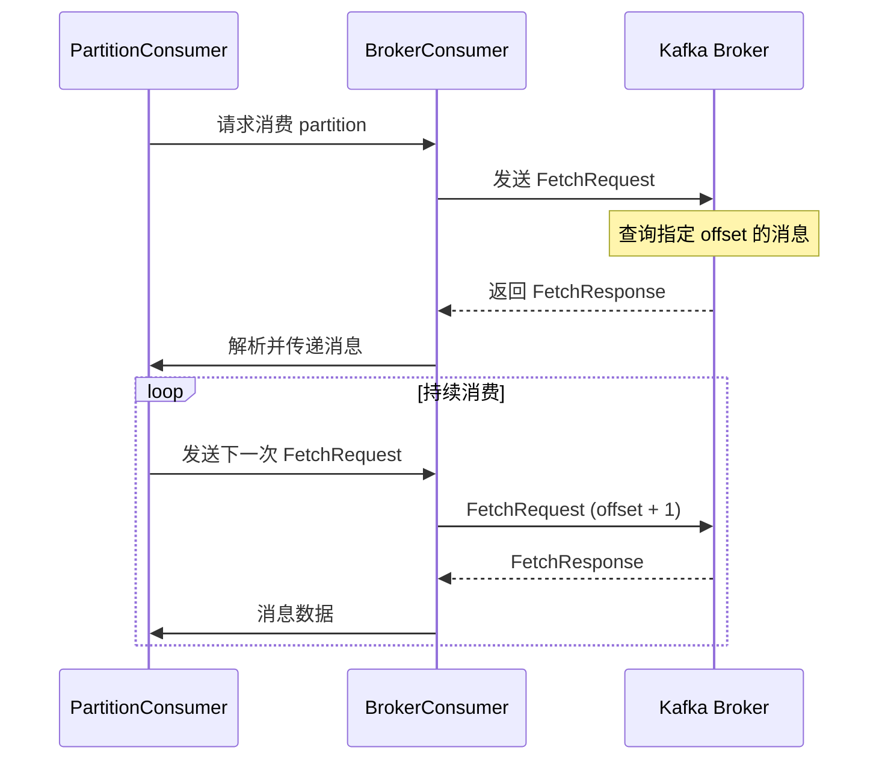

# Kafka Consumer 命令设计文档

## 概述

基于 Go Sarama 实现的 Kafka Consumer 命令设计，分析消费者与 Kafka broker 的交互流程和协议细节。

## 1. 交互流程

### 1.1 Consumer 初始化和消费流程

### 1.2 详细的消息消费子流程

## 2. 涉及的请求/响应消息

### 2.1 ApiVersions 请求/响应

**ApiVersionsRequest**:
- 目的: 检查 broker 支持的 API 版本
- 关键字段:
  - `api_key`: API 密钥
  - `min_version`: 支持的最小版本
  - `max_version`: 支持的最大版本

**ApiVersionsResponse**:
- 关键字段:
  - `api_versions`: 支持的 API 列表
  - `error_code`: 错误码

### 2.2 Metadata 请求/响应

**MetadataRequest**:
- 目的: 获取 topic 和 partition 的元数据信息
- 关键字段:
  - `topics`: 要查询的 topic 列表 (空数组表示所有 topic)
  - `allow_auto_topic_creation`: 是否允许自动创建 topic
  - `include_cluster_authorized_operations`: 是否包含集群授权操作信息

**MetadataResponse**:
- 关键字段:
  - `brokers`: broker 列表信息
  - `cluster_id`: 集群 ID
  - `controller_id`: controller broker ID
  - `topics`: topic 详细信息
    - `name`: topic 名称
    - `partitions`: partition 列表
      - `id`: partition ID
      - `leader`: leader broker ID
      - `replicas`: 副本 broker ID 列表
      - `isr`: 同步副本列表

### 2.3 ListOffset 请求/响应

**ListOffsetRequest** (v1+):
- 目的: 查询指定 partition 的 offset 信息
- 关键字段:
  - `replica_id`: 副本 ID
  - `isolation_level`: 隔离级别
  - `topics`: topic 列表
    - `name`: topic 名称
    - `partitions`: partition 列表
      - `partition_index`: partition ID
      - `timestamp`: 时间戳 (-1 表示最新，-2 表示最早)

**ListOffsetResponse**:
- 关键字段:
  - `topics`: topic offset 信息
    - `name`: topic 名称
    - `partitions`: partition offset 信息
      - `partition_index`: partition ID
      - `error_code`: 错误码
      - `timestamp`: 时间戳
      - `offset`: offset 值
      - `leader_epoch`: leader epoch

### 2.4 Fetch 请求/响应

**FetchRequest** (核心消费请求):
- 目的: 从指定 partition 拉取消息
- 关键字段:
  - `replica_id`: 副本 ID (consumer 通常用 -1)
  - `max_wait_time`: 最大等待时间 (毫秒)
  - `min_bytes`: 最小响应字节数
  - `max_bytes`: 最大响应字节数
  - `isolation_level`: 隔离级别 (0=read_uncommitted, 1=read_committed)
  - `topics`: 要拉取的 topic 列表
    - `name`: topic 名称
    - `partitions`: partition 列表
      - `partition`: partition ID
      - `fetch_offset`: 拉取的起始 offset
      - `log_start_offset`: 日志起始 offset
      - `partition_max_bytes`: partition 最大字节数

**FetchResponse** (核心响应):
- 关键字段:
  - `throttle_time_ms`: 限流时间
  - `error_code`: 错误码
  - `session_id`: 会话 ID
  - `topics`: topic 响应数据
    - `name`: topic 名称
    - `partitions`: partition 响应数据
      - `partition_index`: partition ID
      - `error_code`: partition 错误码
      - `high_watermark`: 高水位 offset
      - `last_stable_offset`: 最后稳定 offset
      - `log_start_offset`: 日志起始 offset
      - `aborted_transactions`: 中止的事务列表
      - `preferred_read_replica`: 首选读副本
      - `records`: 消息记录 (MessageSet 或 RecordBatch)

### 2.5 消息记录格式

**MessageSet (v0/v1 格式)**:
- 关键字段:
  - `messages`: 消息列表
    - `offset`: offset
    - `key`: 消息 key
    - `value`: 消息 value
    - `timestamp`: 时间戳 (v1+)

**RecordBatch (v2+ 格式)**:
- 关键字段:
  - `first_offset`: 起始 offset
  - `partition_leader_epoch`: partition leader epoch
  - `magic`: 魔数
  - `crc`: CRC 校验和
  - `attributes`: 属性
  - `last_offset_delta`: 最后 offset 增量
  - `first_timestamp`: 起始时间戳
  - `max_timestamp`: 最大时间戳
  - `producer_id`: 生产者 ID
  - `producer_epoch`: 生产者 epoch
  - `base_sequence`: 基础序列号
  - `records`: 记录列表

## 3. 关键实现细节

### 3.1 Offset 策略
- **OffsetOldest**: 使用 ListOffsetRequest 获取最早 offset
- **OffsetNewest**: 使用 ListOffsetRequest 获取最新 offset
- **具体 Offset**: 直接使用用户指定的 offset

### 3.2 消息拉取循环
1. 发送 FetchRequest 指定 offset
2. 接收 FetchResponse 解析消息
3. 更新 offset 为最后一条消息的 offset + 1
4. 重复步骤 1-3

### 3.3 错误处理
- **OffsetOutOfRange**: offset 超出范围，需要重新获取有效 offset
- **NotLeaderForPartition**: partition leader 变更，需要重新获取元数据
- **ReplicaNotAvailable**: 副本不可用，需要重试

### 3.4 性能优化
- **批量拉取**: 一次拉取多个消息
- **长连接**: 复用网络连接
- **背压控制**: 通过 min_bytes 和 max_wait_time 控制拉取频率