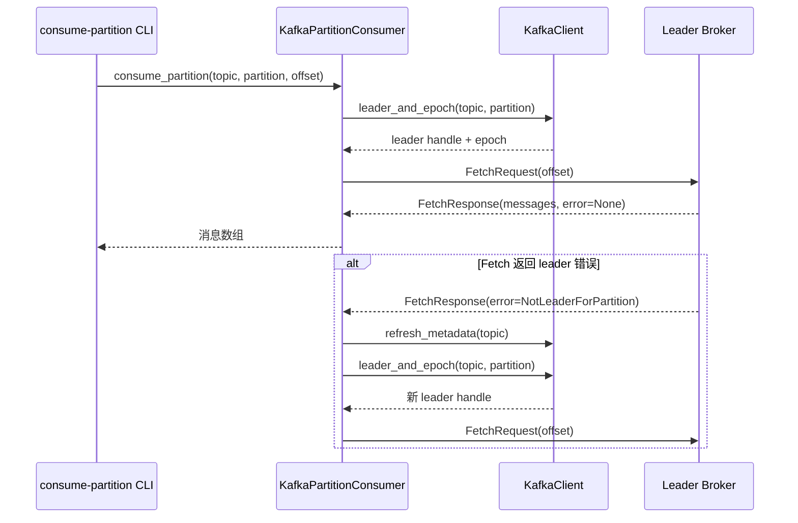

## consume-partition 自动 Leader 选择设计

### 背景

现有 MVP 分区消费者创建时只解析一次元数据并固定连接在返回的 broker 上，一旦 leader 发生漂移或客户端拿到的是内部地址，Fetch 请求会直接失败（例如返回 `LeaderNotAvailable` / `NotLeaderForPartition`）。为了在 CLI 中提供更鲁棒的体验，需要对照 Go Sarama 的成熟做法，支持按需刷新元数据并自动切换到新的 leader broker。

### 流程概览

1. `consume-partition` 命令调用 `consumer.consume_partition(topic, partition, offset)`。
2. 分区消费者在 `dispatch` 阶段通过 `kafka_client_leader_and_epoch` 获取当前 leader。
3. 请求会在 `broker_consumer` 内部循环触发 Fetch；若返回与 leader 相关的错误，则触发重新调度。
4. 重新调度会刷新元数据并再次选取 leader，直到成功消费或返回不可恢复错误。

### 交互时序

### 关键实现要点

- `KafkaPartitionConsumer` 内部直接构造 `MetadataRequest`/`OffsetRequest`，从现有种子地址拉取元数据并缓存当前 leader。
- 当 `FetchResponse` 返回 `LeaderNotAvailable`、`NotLeaderForPartition`、`ReplicaNotAvailable` 等错误时，立即重新请求元数据并改写到新的 leader 地址。
- 如果集群返回的是容器内主机名（例如 `kafka-2:9091`），根据 broker id 映射到本地 Toxiproxy 端口（`localhost:2909{ id }`）。
- CLI 输出保持同步流程，内部自动重试与切换后对用户透明。

### 错误处理

- 对于 leader 相关错误，系统自动重试并重绑新的 broker。
- 对于非可恢复错误（如 offset 越界、网络断开），保持现状直接向上抛出，让 CLI 命令提示用户。
